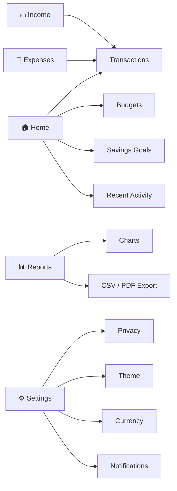
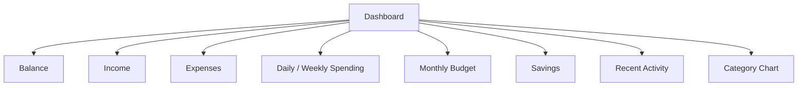
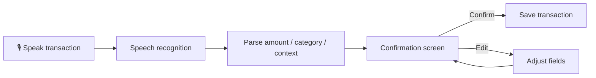
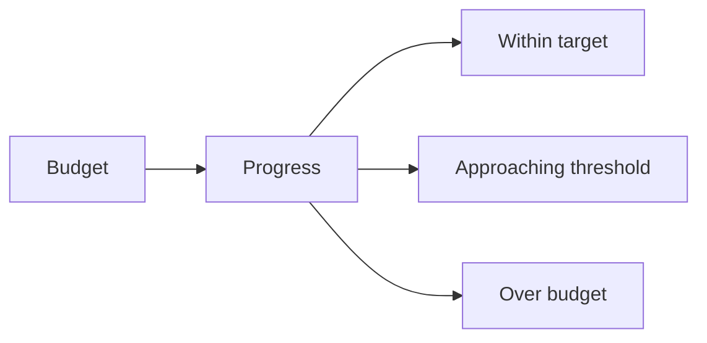
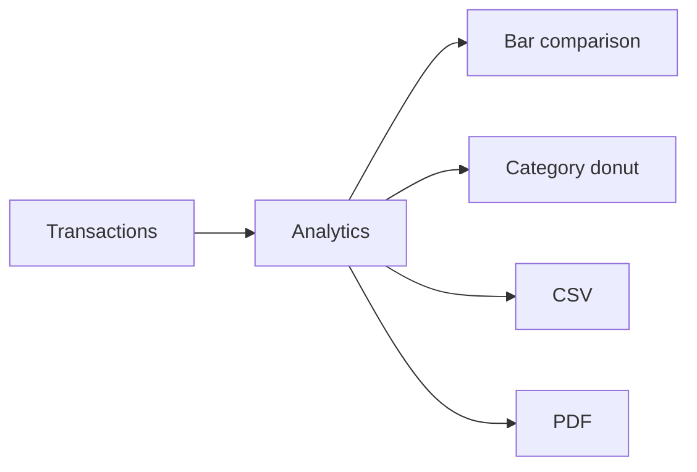
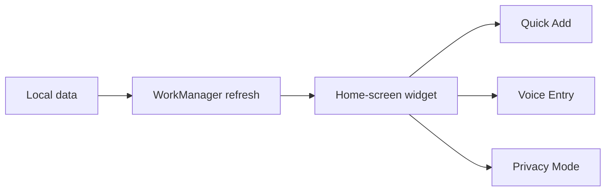
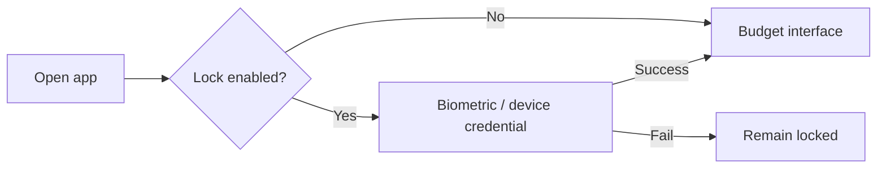
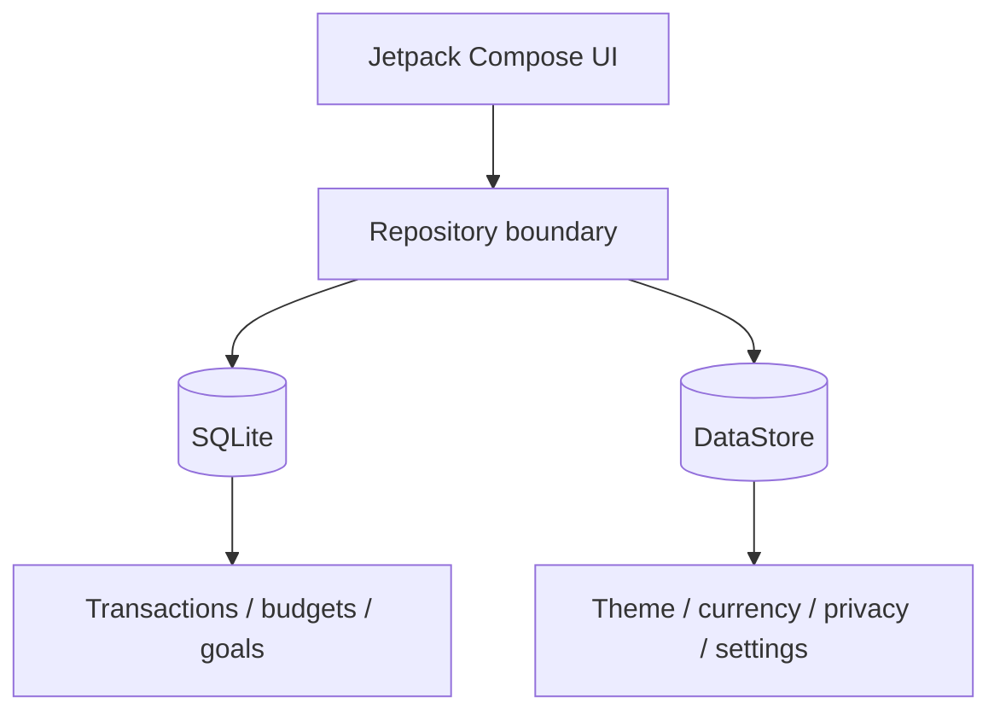
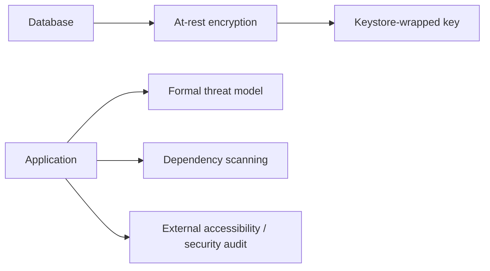

<div align="center">

# 📖 Grimoire

### Offline-first personal finance for Android

Fast transaction capture, calm financial insight, privacy, accessibility, and one-handed use — without requiring an account or cloud connection.

<br>


**Offline-first · No account · Local data · Privacy mode · Accessible by design**

</div>

---

## Overview

**Grimoire** is an offline-first Android personal finance app built with **Kotlin, Jetpack Compose, and Material 3**.

It is designed around four principles:

- ⚡ **Fast capture** — record transactions with minimal friction
- 🧘 **Calm insight** — surface useful financial context without overwhelming the user
- 🔒 **Privacy** — keep financial data local by default
- 👍 **Accessible interaction** — support one-handed use, readable layouts, and privacy-aware widgets

Cloud synchronization is intentionally **not enabled** in the default build.

There is no account system, and Grimoire does not send financial data to an application backend.

---

## At a glance

| Area | Included |
|---|---|
| 🏠 Dashboard | Balance, income, expenses, spending, savings, recent activity, category chart |
| 💸 Transactions | Create, edit, duplicate, delete, undo, search, filter, sort |
| 🎙️ Voice entry | Natural-language transaction entry with confirmation |
| 📊 Reports | Today/week/month/year/all-time analytics with charts |
| 🎯 Budgets | Monthly and custom/category budgets |
| 💰 Savings | Goals and contributions |
| 📱 Widget | Resizable home-screen widget with quick actions |
| 🔐 Security | Biometric/device-credential lock and privacy mode |
| 📁 Export | CSV and PDF report export |
| 🌗 Themes | Light, dark, and system themes |
| 💾 Storage | Local SQLite persistence and DataStore preferences |

---

## App navigation



---

## Dashboard

The Home screen provides a compact summary of the user's finances.

### Included insight

- current balance
- total income
- total expenses
- daily spending
- weekly spending
- monthly budget
- savings
- recent activity
- category breakdown chart
- privacy mode



Privacy mode can mask monetary values in both the application and the home-screen widget.

---

## Transaction management

Grimoire supports a complete local transaction workflow.

### Actions

- create
- edit
- duplicate
- delete
- undo delete
- search
- filter
- sort

### Transaction fields

| Field | Supported |
|---|---|
| Amount | ✅ |
| Category | ✅ |
| Date | ✅ |
| Payment method | ✅ |
| Notes | ✅ |
| Tags | ✅ |
| Receipt | ✅ |
| Recurrence | ✅ |
| Validation | ✅ |

---

## Voice transaction entry

Natural-language voice entry is designed to make capture faster while keeping the user in control.



The app also supports separate speech-to-text input for:

- descriptions
- notes

> Grimoire stores only the **confirmed transaction data**. It does not store an audio recording.

Speech recognition is handled by the device's installed recognition service.

---

## Budgets

Grimoire supports:

- monthly budgets
- custom budgets
- category-specific budgets
- threshold-aware progress indicators



The goal is to communicate budget state clearly without turning the interface into a high-pressure alert system.

---

## Savings goals

Savings tools support:

- creating goals
- tracking target amounts
- recording contributions
- monitoring progress over time

```text
Goal
├── Target amount
├── Current saved amount
├── Contributions
└── Progress
```

---

## Reports

Reports can summarize:

- today
- week
- month
- year
- all time

They include:

- bar-chart comparisons
- donut-chart breakdowns
- CSV export
- PDF export



---

## Home-screen widget

Grimoire includes a **resizable Android AppWidget**.

The widget can show:

- balance
- spending progress
- quick add
- voice entry
- privacy mode

WorkManager powers periodic widget refresh.



---

## Privacy and security

Privacy is a core part of the default build.

### Current protections

- Android Auto Backup is disabled for financial data
- financial data is stored locally
- the app does not send financial data to a Grimoire backend
- biometric lock supports strong biometrics or device credential
- privacy mode masks monetary values
- receipt access uses Android's document picker
- broad storage permission is not required
- speech audio is not retained by Grimoire

> [!IMPORTANT]
> The device's installed speech-recognition service may have its own privacy behavior. Grimoire only stores the confirmed transaction result.

### App lock



---

## Local-first data model

Grimoire separates persistence behind a repository boundary.



This keeps the default build fully local while preserving a clean integration seam for a future **opt-in encrypted synchronization** implementation.

Cloud sync is **not enabled** in the current build.

---

## Project structure

```text
app/src/main/java/com/cyanbudget/app/
├── data/       SQLite database, repository, DataStore settings
├── domain/     voice parser and validation
├── model/      entities, categories, currency and analytics
├── ui/         Compose screens and reusable components
├── widget/     Android AppWidget provider
└── work/       periodic refresh and notification worker
```

See:

- [`docs/ARCHITECTURE.md`](docs/ARCHITECTURE.md)
- [`docs/USER_FLOWS.md`](docs/USER_FLOWS.md)

---

## Technology stack

| Component | Technology |
|---|---|
| Language | Kotlin |
| UI | Jetpack Compose |
| Design system | Material 3 |
| Local database | SQLite |
| Preferences | DataStore |
| Background jobs | WorkManager |
| Authentication | Android biometrics / device credential |
| Widget | Android AppWidget |
| Target SDK | Android SDK 35 |
| Build JDK | JDK 17 |

---

## Build

### Requirements

- **Android Studio Ladybug** or newer
- **JDK 17**
- **Android SDK 35**
- **Build Tools 35.0.0**

### Build and run unit tests

From the project directory:

```powershell
.\gradlew.bat testDebugUnitTest assembleDebug
```

The debug APK is generated at:

```text
app/build/outputs/apk/debug/app-debug.apk
```

### Instrumentation tests

With an emulator or Android device connected:

```powershell
.\gradlew.bat connectedDebugAndroidTest
```

---

## Tests

The project includes:

- unit tests
- Compose UI onboarding test

The current checked-in build supports verification of core application logic and onboarding behavior.

---

## Development note

`local.properties` is machine-specific and should not be committed.

Remove it before committing if necessary. Android Studio will recreate it with the correct local SDK path.

---

## Production hardening

For regulated, financial, enterprise, or otherwise high-risk deployment, the current build should be extended with additional controls.

Recommended areas include:



Possible hardening work:

- database-at-rest encryption
- SQLCipher or equivalent encrypted storage
- Android Keystore-backed key protection
- formal threat modeling
- dependency vulnerability scanning
- external accessibility audit
- external security review

> The current README does not claim that Grimoire is certified for regulated financial environments.

---

## Design philosophy

Grimoire is built around a simple principle:

> **Personal finance software should help users understand their money without requiring them to give up control of their financial data.**

That means prioritizing:

- local ownership
- understandable insight
- quick interaction
- accessible controls
- low-friction transaction capture
- privacy by default

---

## License

Grimoire is released under the **Community Non-Commercial License v1.0**.

Permitted uses include personal, educational, academic, research, evaluation, hobby, and other **non-commercial** use, subject to the full license terms.

Commercial use — including commercial deployment, incorporation into a paid product or service, SaaS/hosted use, paid customer services, or other commercial exploitation — requires prior written authorization or a separate commercial license from **Cyanex**.

See:

[`LICENSE`](LICENSE)

> Third-party libraries and components remain subject to their respective licenses.

---

<div align="center">

### 📖 Grimoire

**Private by default. Clear at a glance. Built for everyday money.**

Local-first · Accessible · Calm · Offline-ready

</div>
